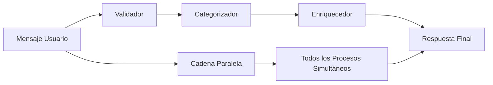

# 📁 DOCUMENTACIÓN COMPLETA - CARPETA RUNNABLES

## 🎯 **¿QUÉ ES LA CARPETA RUNNABLES?**

La carpeta `runnables` contiene funciones ejecutables personalizadas basadas en **LangChain** que permiten crear flujos de procesamiento modulares y reutilizables para SUNABOT. Utiliza el concepto de **Runnables** de LangChain para crear cadenas de procesamiento flexibles.

---

## 📂 **ESTRUCTURA DE LA CARPETA**

```
runnables/
├── __init__.py                 # Archivo de inicialización del módulo
├── custom_runnables.py         # Funciones ejecutables personalizadas
└── __pycache__/               # Cache de Python (generado automáticamente)
```

---

## 🔧 **ARCHIVO: custom_runnables.py**

### **Clase Principal: `SunatRunnables`**

Esta clase contiene métodos estáticos que crean diferentes tipos de Runnables especializados para el procesamiento de consultas de SUNAT.

---

## 🛠️ **RUNNABLES DISPONIBLES**

### **1. 🏷️ Runnable Categorizador**
```python
@staticmethod
def crear_runnable_categorizar() -> RunnableLambda:
```

**Función:** Categoriza automáticamente los mensajes de usuario según el tema tributario.

**Entrada:** Mensaje de texto (string) o diccionario con "mensaje"
**Salida:** Diccionario con:
- `categoria`: Categoría detectada (RUC, Declaraciones, Facturación, etc.)
- `confianza`: Nivel de confianza (0.0 - 1.0)
- `mensaje_original`: Mensaje original del usuario
- `palabras_detectadas`: Lista de palabras clave encontradas

**Categorías disponibles:**
- **RUC**: registro único, inscripción, contribuyente
- **Declaraciones**: declaración, djm, cronograma, vencimiento
- **Facturación**: factura, comprobante, boleta, electrónica
- **Clave SOL**: clave sol, contraseña, acceso, usuario
- **Regímenes**: régimen, rus, rer, mype, general
- **Otros**: Para consultas que no encajan en categorías específicas

---

### **2. ✅ Runnable Validador**
```python
@staticmethod
def crear_runnable_validador() -> RunnableLambda:
```

**Función:** Valida la entrada del usuario antes del procesamiento.

**Validaciones que realiza:**
- `es_valido`: El mensaje no está vacío
- `longitud_apropiada`: Entre 3 y 1000 caracteres
- `tiene_contenido`: Contiene texto real (no solo espacios)
- `es_tributario`: Contiene palabras relacionadas con temas tributarios

**Salida:** Diccionario original + validaciones y estado general

---

### **3. 🌟 Runnable Enriquecedor**
```python
@staticmethod
def crear_runnable_enriquecedor() -> RunnableLambda:
```

**Función:** Enriquece los datos con información adicional según la categoría.

**Datos que añade:**
- `enlaces_recomendados`: URLs relevantes para cada categoría
- `contexto_categoria`: Descripción del especialista
- `timestamp`: Marca de tiempo del procesamiento
- `version_procesamiento`: Versión del sistema

**Enlaces por categoría:**
- **RUC**: Consulta RUC, Registro RUC
- **Declaraciones**: Cronograma, Portal SOL
- **Facturación**: Verificación comprobantes, Consulta libre
- **Clave SOL**: Login SOL, Recuperar clave
- **Regímenes**: Portal SOL
- **Otros**: Portal SOL general

---

### **4. ⚡ Cadena Paralela Completa**
```python
@staticmethod
def crear_cadena_paralela_completa() -> RunnableParallel:
```

**Función:** Ejecuta múltiples Runnables en paralelo para máximo rendimiento.

**Procesos paralelos:**
- `categorizar`: Detecta la categoría del mensaje
- `validar`: Valida la entrada del usuario
- `enriquecer`: Categoriza y luego enriquece con datos adicionales

**Ventajas:**
- ⚡ Procesamiento más rápido
- 🔄 Datos procesados simultáneamente
- 📊 Resultados completos en una sola ejecución

---

### **5. 🚀 Runnable Procesador Asíncrono**
```python
@staticmethod
def crear_runnable_async_procesador() -> RunnableLambda:
```

**Función:** Realiza procesamiento asíncrono avanzado con ThreadPoolExecutor.

**Características:**
- 🔄 Procesamiento asíncrono real
- 🧵 Múltiples hilos de ejecución (max 3 workers)
- ⏱️ Simulación de procesos complejos
- 📈 Métricas de rendimiento

**Procesos paralelos internos:**
- Análisis de contenido
- Validación avanzada
- Enriquecimiento de datos

---

## 💡 **CÓMO SE USAN LOS RUNNABLES**

### **En el archivo app.py:**

```python
# Importación
from runnables.custom_runnables import SunatRunnables

# Inicialización
categorizar_runnable = SunatRunnables.crear_runnable_categorizar()
validador_runnable = SunatRunnables.crear_runnable_validador()
cadena_paralela = SunatRunnables.crear_cadena_paralela_completa()

# Uso en endpoint /responder_langchain
def responder_langchain():
    # Validar entrada
    validacion = validador_runnable.invoke({"mensaje": consulta_input.mensaje})
    
    # Procesamiento paralelo
    resultado_paralelo = cadena_paralela.invoke({"mensaje": consulta_input.mensaje})
```

---

## 🎯 **VENTAJAS DE LOS RUNNABLES**

### **1. 🔧 Modularidad**
- Cada Runnable tiene una función específica
- Fácil de mantener y actualizar
- Reutilizable en diferentes contextos

### **2. ⚡ Rendimiento**
- Procesamiento paralelo
- Ejecución asíncrona cuando es necesario
- Optimización de recursos

### **3. 🔄 Flexibilidad**
- Se pueden combinar fácilmente
- Crear cadenas complejas de procesamiento
- Fácil extensión con nuevos Runnables

### **4. 🧪 Testeable**
- Cada Runnable es independiente
- Fácil de probar unitariamente
- Debugging simplificado

---

## 📊 **FLUJO DE PROCESAMIENTO TÍPICO**



---

## 🚀 **EJEMPLOS DE USO**

### **Categorización Simple:**
```python
categorizar = SunatRunnables.crear_runnable_categorizar()
resultado = categorizar.invoke("¿Cómo consulto mi RUC?")
# Output: {"categoria": "RUC", "confianza": 0.33, ...}
```

### **Validación:**
```python
validador = SunatRunnables.crear_runnable_validador()
resultado = validador.invoke({"mensaje": "Consulta sobre facturas"})
# Output: {"validaciones": {...}, "es_consulta_valida": True}
```

### **Procesamiento Paralelo:**
```python
cadena = SunatRunnables.crear_cadena_paralela_completa()
resultado = cadena.invoke({"mensaje": "¿Cómo declarar impuestos?"})
# Output: {"categorizar": {...}, "validar": {...}, "enriquecer": {...}}
```

---

## 🔮 **POSIBLES EXTENSIONES**

### **Nuevos Runnables que podrías añadir:**

1. **📝 Runnable Generador de Prompts**
   - Crear prompts específicos por categoría
   - Optimización de instrucciones para el LLM

2. **🔍 Runnable Detector de Intenciones**
   - Detectar si el usuario quiere información, ayuda, o realizar una acción
   - Análisis de sentimiento

3. **📈 Runnable de Métricas**
   - Recopilar estadísticas de uso
   - Análisis de patrones de consultas

4. **🔒 Runnable de Seguridad**
   - Filtrar contenido inapropiado
   - Validar consultas legítimas

---

## 🎯 **IMPORTANCIA EN EL SISTEMA**

Los Runnables son **fundamentales** para SUNABOT porque:

1. **🏗️ Arquitectura Limpia**: Separan la lógica de procesamiento
2. **⚡ Alto Rendimiento**: Procesamiento paralelo y asíncrono
3. **🔧 Fácil Mantenimiento**: Código modular y testeable
4. **📈 Escalabilidad**: Fácil añadir nuevas funcionalidades
5. **🔄 Flexibilidad**: Combinar diferentes procesos según necesidad

Los Runnables son la **columna vertebral** del procesamiento inteligente de SUNABOT, permitiendo que el sistema sea tanto potente como mantenible. 🤖✨
